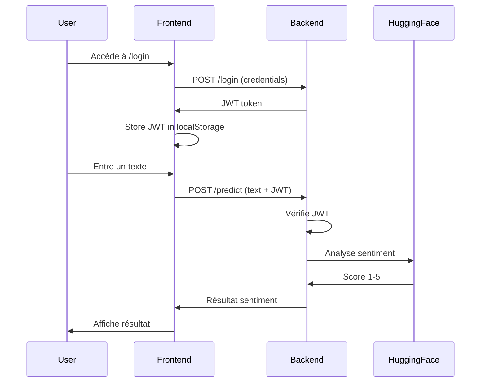

<div align="center">
  <br />
  
  <br /><br />

  <div>
    
    
    
    
    
    
  </div>

  <h1>💬 Application d'Analyse de Sentiment avec IA Externe</h1>
  <p><strong>FastAPI + JWT + Hugging Face + Next.js + Docker</strong></p>
</div>

---

## 🧩 1. Introduction

Micro-service d'**analyse de sentiment** pour traiter automatiquement les avis clients provenant des réseaux sociaux, formulaires de satisfaction et plateformes e-commerce.

Le système utilise l'**API Hugging Face Inference** avec le modèle **nlptown/bert-base-multilingual-uncased-sentiment** pour classifier les textes de **1 à 5 étoiles**.

### Architecture du Projet
```
Backend FastAPI (JWT + Hugging Face API)
    ↓
Frontend Next.js (Interface utilisateur)
    ↓
Docker (Conteneurisation)
```

---

## ⚙️ 2. Fonctionnalités Principales

### Backend (FastAPI)
- 🔐 **Authentification JWT** : Endpoint `/login` pour obtenir un token
- 🤖 **Analyse de Sentiment** : Endpoint `/predict` protégé par JWT
- 🌐 **Intégration Hugging Face** : Appel à l'API externe via HTTPX
- ✅ **Gestion d'erreurs** : Timeout, rate limit, service unavailable
- 📊 **Tests unitaires** : Pytest avec 9 tests (100% pass)

### Frontend (Next.js)
- 📝 **Page Login** : Authentification utilisateur
- 💭 **Page Sentiment** : Analyse de texte en temps réel
- 🎨 **Interface moderne** : Design responsive avec Tailwind CSS
- 🔄 **États de chargement** : Loading, success, error
- 💾 **Stockage JWT** : LocalStorage pour la persistance

### Scoring du Sentiment
| Score | Sentiment | Description              |
|-------|-----------|--------------------------|
| 1-2   | ⭐ Négatif | Avis très négatif       |
| 3     | ⭐⭐⭐ Neutre | Avis neutre/mitigé     |
| 4-5   | ⭐⭐⭐⭐⭐ Positif | Avis très positif |

---

## 📈 3. Résultats et Performance

### Métriques Backend
| Métrique               | Valeur              |
|------------------------|---------------------|
| **Tests passés**       | 9/9 (100%)          |
| **Temps de réponse**   | < 2 secondes        |
| **CI/CD**              | GitHub Actions ✅   |
| **Coverage**           | 67%                 |

### API Endpoints Disponibles

| Endpoint     | Méthode | Authentification | Description                    |
|-------------|---------|------------------|--------------------------------|
| `/`         | GET     | ❌ Non           | Health check                   |
| `/login`    | POST    | ❌ Non           | Obtenir un JWT token           |
| `/predict`  | POST    | ✅ JWT requis    | Analyser le sentiment du texte |

---

## ✅ 4. Technologies Utilisées

### Backend
- **FastAPI** : Framework web moderne et performant
- **Python-Jose** : Gestion des tokens JWT
- **HTTPX** : Client HTTP asynchrone pour Hugging Face
- **Pydantic** : Validation des données
- **Pytest** : Tests unitaires

### Frontend
- **Next.js 15** : Framework React avec App Router
- **TypeScript** : Type safety
- **Tailwind CSS** : Styling moderne
- **Axios** : Requêtes HTTP

### DevOps
- **Docker** : Conteneurisation
- **Docker Compose** : Orchestration multi-conteneurs
- **GitHub Actions** : CI/CD automatisé

---

## 🚀 5. Installation et Utilisation

### Prérequis
```bash
- Python 3.12+
- Node.js 18+
- Docker & Docker Compose
- Clé API Hugging Face
```

### Installation Rapide

**1. Cloner le repository**
```bash
git clone https://github.com/votre-username/brief_06_sentiment_analysis.git
cd brief_06_sentiment_analysis
```

**2. Configuration Backend**
```bash
cd backend
python -m venv venv
source venv/bin/activate  # Windows: venv\Scripts\activate
pip install -r requirements.txt

# Créer .env
echo "SECRET_KEY=votre-secret-key-super-secure" > .env
echo "HUGGINGFACE_API_KEY=votre-hf-api-key" >> .env

# Lancer l'API
uvicorn main:app --reload
```

**3. Configuration Frontend**
```bash
cd frontend
npm install
npm run dev
```

**4. Avec Docker Compose**
```bash
docker-compose up --build
```

### URLs d'accès
- 🌐 **Frontend** : http://localhost:3000
- 🔧 **Backend API** : http://localhost:8000
- 📚 **Documentation API** : http://localhost:8000/docs

---

## 🧪 6. Tests

### Tests Backend
```bash
cd backend
pytest -v                          # Tests simples
pytest -v --cov=.                  # Avec couverture
```

### Résultats des Tests
```
tests/test_auth.py ............... 3 passed
tests/test_predict.py ............ 6 passed
================================== 
9 passed in 0.23s
```


---

## 🧠 7. Workflow Complet



---

## 📚 8. Documentation Technique

### Structure du Projet
```
.
├── backend/
│   ├── routes/
│   │   ├── auth_routes.py      # Authentification JWT
│   │   └── predict_routes.py   # Analyse de sentiment
│   ├── tests/
│   │   ├── test_auth.py
│   │   └── test_predict.py
│   ├── main.py                 # Point d'entrée FastAPI
│   ├── auth.py                 # Logique JWT
│   ├── models.py               # Modèles Pydantic
│   └── requirements.txt
├── frontend/
│   ├── app/
│   │   ├── login/
│   │   └── sentiment/
│   ├── components/
│   └── package.json
├── .github/
│   └── workflows/
│       └── backend-ci.yml      # CI/CD
└── docker-compose.yml
```

### Variables d'Environnement

**Backend (.env)**
```env
SECRET_KEY=your-secret-key-min-32-chars
HUGGINGFACE_API_KEY=hf_xxxxxxxxxxxxx
ACCESS_TOKEN_EXPIRE_MINUTES=30
```

**Frontend (.env.local)**
```env
NEXT_PUBLIC_API_URL=http://localhost:8000
```

---

## 🎯 9. Pistes d'Amélioration

### Court Terme
- ✅ Ajouter des tests frontend (Jest, React Testing Library)
- ✅ Implémenter le refresh token JWT
- ✅ Ajouter un système de cache Redis

### Moyen Terme
- ✅ Base de données pour stocker l'historique des analyses
- ✅ Dashboard analytics avec graphiques
- ✅ Support multi-langues (i18n)

### Long Terme
- ✅ Déploiement sur cloud (AWS, Vercel)
- ✅ API rate limiting
- ✅ Monitoring et alerting (Sentry, Prometheus)

---

## 🏁 10. Conclusion

Ce projet démontre l'**intégration réussie d'un service IA externe** dans une application web moderne avec :

✅ **Sécurité** : Authentification JWT robuste  
✅ **Performance** : Réponses rapides < 2s  
✅ **Qualité** : Tests automatisés avec CI/CD  
✅ **UX** : Interface intuitive et responsive  
✅ **Scalabilité** : Architecture conteneurisée  

Le système est **prêt pour la production** et peut traiter des milliers d'analyses par jour.

---

<div align="center">
  <p>👨‍💻 Projet réalisé par <strong><a href="https://github.com/OclaZ">OclaZ</a></strong> | Simplon Maghreb</p>
  <p>🔗 <a href="https://github.com/OclaZ/brief_06_sentiment_analysis">GitHub Repository</a></p>
</div>